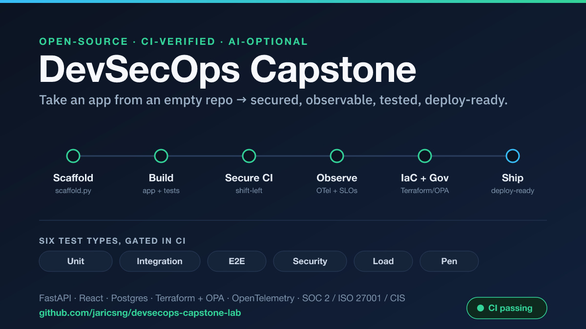

# DevSecOps Capstone Lab



A hands-on capstone built around the
[`platform-starter-kit`](https://github.com/jaricsng/platform-starter-kit) — a
public library of DevSecOps platform assets (CI/CD, observability, IaC,
governance, load/pen testing, Day-2 ops, and self-service tooling).

By the end you will have taken **an application of your own choosing** from an
empty repo to a **scaffolded, secured, observable, load-tested, deploy-ready**
service — wiring up every capability the kit curates, and understanding *why*
each one is there.

To prove the path works, this repo ships a complete worked example:
**[`reference-solution/`](reference-solution/)** — *ShopKit*, a small e-commerce
app (FastAPI + React + Postgres + Stripe sandbox) built on the kit's golden
path. Use it as an answer key, not a thing to copy wholesale.

> `reference-solution/` is a **git submodule** pointing at the standalone
> [`jaricsng/shopkit`](https://github.com/jaricsng/shopkit) repo (single source
> of truth — its CI is the live proof these pieces work). Clone with
> `git clone --recurse-submodules …`, or run `git submodule update --init`
> after a plain clone, to populate it.

---

## Who this is for

- **A solo learner** (anyone on the public internet) — the core path is
  complete on its own. You can finish the entire capstone alone.
- **A team** — an additive [Team Track (Module 09)](modules/09-team-track.md)
  layers on the collaboration safety the kit provides (shared infra state,
  deploy concurrency, code ownership, reproducible environments). It is
  *optional*: solo learners read it and move on; teams complete it.

No prior platform-engineering experience is assumed. You do need to be
comfortable on a command line and with one programming stack.

---

## Two ways to do every module

Not everyone has Claude Code, so **every module is written for two tracks that
end at the exact same checkpoint:**

| | **🤖 Claude Code track** | **🛠️ Manual track** |
|---|---|---|
| How you build | Prompt Claude Code; run the kit's `claude-commands/` (`/threat-model`, `/security-review`, `/check-python`, `/load-test`, …) | Use the kit's own tooling (`scaffold.py`, `doctor.py`, `make` targets, `sync_check.py`) and copy/diff against `reference-solution/` |
| What you need | A Claude Code subscription | Nothing beyond the [prerequisites](PREREQUISITES.md) |
| Where you end up | **Identical checkpoint** — same passing `doctor.py`, same green CI, same lit dashboards | **Identical checkpoint** |

Pick whichever you have access to. You can mix — e.g. build manually but use
`/security-review` for Module 06. The **Checkpoint** at the end of each module
is the single source of truth for "am I done?"

---

## Bring your own stack

The reference solution uses the kit's **golden path**: FastAPI + SQLAlchemy +
Postgres backend, React/TypeScript frontend, deploying to GCP Cloud Run. **You
do not have to.** The kit fits any *containerized HTTP service* (see
`docs/ARCHITECTURE-FIT.md` in the kit). Every module includes a **"Different
stack?"** callout pointing at the exact section of the kit's
`docs/TECH-STACK-SWAP-GUIDE.md` you need.

Documenting one swap you evaluated is a required capstone deliverable (see
[RUBRIC.md](RUBRIC.md)).

---

## How to start

1. Read **[PREREQUISITES.md](PREREQUISITES.md)** and install the tools.
2. Clone the kit next to this repo:
   ```bash
   git clone https://github.com/jaricsng/platform-starter-kit
   # you should now have ../platform-starter-kit alongside this lab
   ```
3. Fork this lab repo (so you have somewhere to record your progress), then work
   through the modules in order:

| # | Module | Capability exercised |
|---|--------|----------------------|
| 00 | [Orientation — see the kit work](modules/00-orientation.md) | minimal-service + observability boot |
| 01 | [Scaffold your repo](modules/01-scaffold.md) | `scaffold.py`, `doctor.py`, `TODO.md` |
| 02 | [Build the app → doctor-green](modules/02-build-app.md) | container, `/health`+`/ready`, OTel, tests, DB |
| 03 | [Shift-left security & CI](modules/03-shiftleft-ci.md) | pre-commit, GitHub Actions CI |
| 04 | [Observability](modules/04-observability.md) | OTel → Prometheus/Grafana/Jaeger, SLOs |
| 05 | [Load testing](modules/05-load-testing.md) | k6 / Locust |
| 06 | [Security review & pen-test](modules/06-security-pentest.md) | manual checks, ZAP, threat model |
| 07 | [IaC, governance & migration safety](modules/07-iac-governance.md) | Terraform, Conftest/OPA, migration gate |
| 08 | [Day-2 ops & safe delivery](modules/08-day2-ops.md) | SLOs, runbooks, feature flags |
| 09 | [Team track *(optional)*](modules/09-team-track.md) | CODEOWNERS, concurrency, shared state |
| 10 | [Stay in sync & submit](modules/10-sync-and-submit.md) | `sync_check.py`, completion report |

> **Conventions used in the modules**
> - `<kit>` = path to your `platform-starter-kit` clone (e.g. `../platform-starter-kit`).
> - `<repo>` = the new repo you scaffold for *your* app in Module 01.
> - Commands prefixed `# 🤖` are Claude Code track; `# 🛠️` are manual track;
>   unprefixed commands apply to both.

---

## What "done" looks like

You've completed the capstone when your repo meets the bar in
**[RUBRIC.md](RUBRIC.md)** — at minimum: `doctor.py` reports zero FAILs, CI is
green, your dashboards show real traffic from your own app, a load test passes
its thresholds, you've recorded security findings, `terraform plan` is clean,
and the migration-safety gate is wired. A central habit is the **testing
discipline** — you build all six test types (unit, integration, e2e, security,
load, pen) mapped to the lifecycle; see **[docs/TESTING-STRATEGY.md](docs/TESTING-STRATEGY.md)**.
**[KIT-VERIFICATION.md](KIT-VERIFICATION.md)** maps every kit capability to the
module that exercises it and the objective signal that proves it works, and
**[COMPLIANCE.md](COMPLIANCE.md)** maps the controls to SOC 2 / ISO 27001 / CIS,
with the **[governance/](governance/) pack** providing adopt-ready templates for
the organizational controls (data governance, access reviews, risk & vendor
registers, BCP/DR, incident & breach response, pen-test policy, training, and an
audit-evidence checklist) — and is honest that *operating* them on a cadence is
the org's job, not the repo's.

---

## License

This lab is provided for educational use. The reference solution is example
code, not production-ready — treat it as a teaching artifact.
